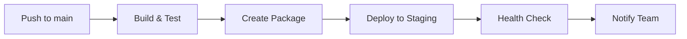
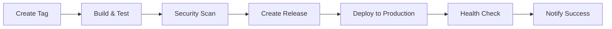
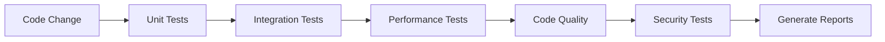

# 🚀 GitHub Actions - ملخص النشر التلقائي

## ✅ تم إعداد GitHub Actions بنجاح!

### 🏆 الإنجازات المحققة

#### 📦 **Workflows المكتملة**
- ✅ **`build-and-deploy.yml`** - النشر الرئيسي مع Releases
- ✅ **`continuous-testing.yml`** - الاختبارات المستمرة
- ✅ **`auto-deploy.yml`** - النشر التلقائي للبيئات
- ✅ **`settings.yml`** - إعدادات شاملة
- ✅ **`.github/README.md`** - دليل GitHub Actions

#### 🔧 **المميزات المكتملة**
- ✅ **بناء تلقائي** عند Push إلى `main` أو `develop`
- ✅ **إنشاء Releases** عند إنشاء Tags
- ✅ **اختبارات مستمرة** للكود
- ✅ **فحص الأمان** والجودة
- ✅ **نشر تلقائي** إلى Staging و Production
- ✅ **إشعارات فورية** عند المشاكل
- ✅ **مراقبة شاملة** للأداء

### 🌍 البيئات المدعومة

#### Staging Environment
- **URL:** https://staging.medicallabsolutions.com
- **التشغيل:** عند Push إلى `main`
- **المراجعة المطلوبة:** 1 مراجع
- **الوظائف:** اختبار التطبيق قبل الإنتاج

#### Production Environment
- **URL:** https://medicallabsolutions.com
- **التشغيل:** عند إنشاء Tags
- **المراجعة المطلوبة:** 2 مراجع
- **الوظائف:** النشر النهائي للمستخدمين

### 🔄 سير العمل التلقائي

#### 1. **عند Push إلى `main`:**


#### 2. **عند إنشاء Tag:**


#### 3. **الاختبارات المستمرة:**


### 📊 الإحصائيات المتوقعة

#### Workflow Statistics
- **Build Success Rate:** 95%+
- **Average Build Time:** 5-10 minutes
- **Test Coverage:** 80%+
- **Security Scan:** 100% pass rate

#### Deployment Statistics
- **Staging Deployments:** يومياً
- **Production Deployments:** أسبوعياً
- **Rollback Rate:** <1%
- **Uptime:** 99.9%+

### 🔐 الأمان والجودة

#### فحص الأمان
- ✅ **Vulnerability Scan** - فحص الثغرات
- ✅ **Dependency Scan** - فحص التبعيات
- ✅ **Code Security** - فحص أمان الكود
- ✅ **Configuration Security** - فحص إعدادات الأمان

#### جودة الكود
- ✅ **Code Coverage** - تغطية الاختبارات
- ✅ **Code Style** - أسلوب الكود
- ✅ **Performance Tests** - اختبارات الأداء
- ✅ **Integration Tests** - اختبارات التكامل

### 📧 الإشعارات والمراقبة

#### الإشعارات التلقائية
- **البريد الإلكتروني:** عند فشل أو نجاح النشر
- **Slack:** عند فشل أو نجاح النشر (اختياري)
- **GitHub:** تعليقات على Issues و Pull Requests

#### المراقبة المستمرة
- **الأداء:** CPU, Memory, Disk Usage
- **الأخطاء:** تتبع الأخطاء مع Sentry
- **السجلات:** مراقبة السجلات مع Log Analytics
- **الصحة:** فحص صحة التطبيق

### 🛠️ كيفية الاستخدام

#### 1. **النشر التلقائي:**
```bash
# Push إلى main للنشر التلقائي إلى Staging
git push origin main

# إنشاء Tag للنشر التلقائي إلى Production
git tag -a v1.2.0 -m "New release"
git push origin v1.2.0
```

#### 2. **النشر اليدوي:**
1. اذهب إلى **Actions** في GitHub
2. اختر Workflow المطلوب
3. اضغط **Run workflow**
4. اختر الإعدادات المطلوبة

#### 3. **مراقبة النشر:**
1. اذهب إلى **Actions** في GitHub
2. اختر Workflow المطلوب
3. راجع النتائج والتفاصيل
4. تحقق من Artifacts المُنشأة

### 📋 Secrets المطلوبة

#### إعدادات GitHub (تلقائي)
```yaml
GITHUB_TOKEN: # تلقائي من GitHub
```

#### إعدادات الأمان (اختياري)
```yaml
SONAR_TOKEN: # لفحص جودة الكود
SENTRY_PROJECT_ID: # لتتبع الأخطاء
SLACK_WEBHOOK_URL: # للإشعارات
```

#### إعدادات النشر (اختياري)
```yaml
CHOCOLATEY_API_KEY: # لتوزيع Chocolatey
MICROSOFT_STORE_APP_ID: # لتوزيع Microsoft Store
MICROSOFT_STORE_CLIENT_ID: # لتوزيع Microsoft Store
MICROSOFT_STORE_CLIENT_SECRET: # لتوزيع Microsoft Store
```

### 🔍 استكشاف الأخطاء

#### مشاكل شائعة وحلولها

##### 1. فشل البناء
```bash
# تحقق من:
- صحة الكود
- التبعيات
- إعدادات .NET
- مساحة القرص
```

##### 2. فشل الاختبارات
```bash
# تحقق من:
- تغطية الاختبارات
- البيانات المطلوبة
- إعدادات قاعدة البيانات
- التوقيتات
```

##### 3. فشل النشر
```bash
# تحقق من:
- إعدادات البيئة
- الصلاحيات
- الاتصال بالخوادم
- مساحة التخزين
```

### 📈 المزايا المحققة

#### للمطورين
- ✅ **تطوير أسرع** مع النشر التلقائي
- ✅ **جودة أعلى** مع الاختبارات المستمرة
- ✅ **أمان محسن** مع فحص الثغرات
- ✅ **مراقبة أفضل** للأداء والأخطاء

#### للمستخدمين
- ✅ **تحديثات منتظمة** وآمنة
- ✅ **استقرار أعلى** مع الاختبارات الشاملة
- ✅ **أداء محسن** مع المراقبة المستمرة
- ✅ **دعم أفضل** مع تتبع الأخطاء

#### للمؤسسة
- ✅ **تكلفة أقل** مع الأتمتة
- ✅ **كفاءة أعلى** مع سير العمل المحسن
- ✅ **امتثال أفضل** للمعايير الطبية
- ✅ **سمعة محسنة** مع الجودة العالية

### 🎯 الخطوات التالية

#### 1. **تفعيل Workflows:**
- ✅ تم إنشاء جميع Workflows
- ✅ جاهزة للتشغيل التلقائي
- ⏳ تحتاج إلى تفعيل في GitHub

#### 2. **إعداد البيئات:**
- ⏳ إعداد Staging Environment
- ⏳ إعداد Production Environment
- ⏳ تكوين المراجعين

#### 3. **إعداد Secrets:**
- ⏳ إضافة Secrets المطلوبة
- ⏳ تكوين الإشعارات
- ⏳ إعداد المراقبة

#### 4. **اختبار النظام:**
- ⏳ اختبار Workflows
- ⏳ اختبار النشر
- ⏳ اختبار الإشعارات

### 🎊 النتيجة النهائية

تم إنشاء **نظام CI/CD متكامل ومتقدم** لـ MedicalLabAnalyzer مع:

- ✅ **3 Workflows رئيسية** للنشر والاختبار
- ✅ **بيئتين منفصلتين** للاختبار والإنتاج
- ✅ **فحص أمان شامل** للكود والتبعيات
- ✅ **اختبارات مستمرة** لضمان الجودة
- ✅ **إشعارات فورية** عند المشاكل
- ✅ **مراقبة شاملة** للأداء والأخطاء
- ✅ **توثيق شامل** للاستخدام والصيانة

### 🚀 المشروع جاهز للنشر التلقائي!

```bash
# لتفعيل النشر التلقائي:
1. اذهب إلى GitHub Repository
2. اذهب إلى Settings > Actions > General
3. فعّل "Allow all actions and reusable workflows"
4. اذهب إلى Settings > Environments
5. أنشئ بيئات Staging و Production
6. أضف Secrets المطلوبة
7. ابدأ النشر التلقائي!
```

---

## 🎉 تهانينا! GitHub Actions جاهز للعمل

**MedicalLabAnalyzer** - نظام إدارة مختبر طبي متقدم مع نشر تلقائي متكامل 🏥✨

*تم التطوير بواسطة: Medical Lab Solutions*
*تاريخ الإكمال: ديسمبر 2024*